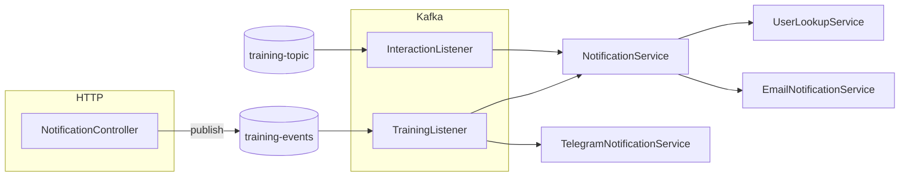

# Training Notification — справочник по классам и методам

Документ описывает каждый публичный метод и ключевые точки входа микросервиса, а также поведение при ошибках и зависимости между компонентами.

---

## Точка входа приложения

### `TrainingNotificationApplication`

| Метод | Описание |
|--------|----------|
| `main(String[] args)` | Запускает Spring Boot: загружает контекст, поднимает веб-сервер, Kafka-консьюмеры, планировщик и асинхронные исполнители. Аннотации класса: `@SpringBootApplication` (автоконфигурация), `@EnableAsync` (асинхронные `@Async`-методы), `@EnableScheduling` (cron-задачи). |

---

## REST API

### `NotificationController`

Базовый путь: `/api/v1/notifications`.

| Метод | HTTP | Путь | Описание |
|--------|------|------|----------|
| `testNotification` | POST | `/test-send` | Принимает тело `TrainingDTO` и **асинхронно** публикует его в Kafka-топик `training-events` через `KafkaTemplate.send(...)` без ожидания ответа брокера. Возвращает **202 Accepted** с пустым телом (`ResponseEntity.accepted().build()`). Используется для ручной проверки цепочки: REST → Kafka → listeners. |

**Параметры `testNotification`:**

- `trainingDTO` — JSON, десериализуемый в `TrainingDTO` (см. раздел DTO).

---

## Глобальная обработка ошибок

### `GlobalExceptionHandler`

`@RestControllerAdvice` — перехватывает исключения в контроллерах и возвращает JSON.

| Метод | Исключение | HTTP | Тело ответа |
|--------|------------|------|-------------|
| `handleException` | `Exception` | 500 | `error`: `"Internal Server Error"`, `message`: текст исключения. Лог: `ERROR`. |
| `handleBadRequest` | `IllegalArgumentException` | 400 | `error`: `"Bad Request"`, `message`: текст исключения. Лог: `WARN`. |

**Замечание:** в Spring выбирается наиболее подходящий обработчик; для `IllegalArgumentException` срабатывает `handleBadRequest`.

---

## Фабрика отправки уведомлений

### `NotificationFactory`

| Метод | Описание |
|--------|----------|
| `getSender(NotificationType type)` | Перебирает все бины `NotificationSender`, внедрённые в `List<NotificationSender>`, и возвращает первый, у которого `supports(type) == true`. Если подходящего нет — бросает `IllegalArgumentException` с текстом `Notification sender not found for type: ...`. |

---

## Потребители Kafka

### `TrainingListener`

Топик: `training-events`, группа: `notification-clean-group`.

| Метод | Описание |
|--------|----------|
| `listen(TrainingDTO trainingDTO)` | Десериализация сообщения в `TrainingDTO`. Логирует получение. Вызывает `NotificationService.processAndSendNotification(trainingDTO)` (email по пользователю из БД). Если `telegramTag()` не null и не пустой — формирует текст на русском и вызывает `TelegramNotificationService.sendTelegramMessage(destination, messageText)`. При любой ошибке в блоке `try` — логирует `ERROR` с полным стеком, не пробрасывает наружу (сообщение не коммитится в зависимости от настроек Kafka; детали — в Spring Kafka). |

### `InteractionListener`

Топик: `training-topic`, группа: `notification-clean-v4`.

| Метод | Описание |
|--------|----------|
| `listen(TrainingDTO trainingData)` | Логирует `userId` и вызывает только `NotificationService.processAndSendNotification(trainingData)` (без Telegram в этом слушателе). |

---

## Сервисы

### `NotificationService` (`service.scheduler`)

| Метод | Описание |
|--------|----------|
| `processAndSendNotification(TrainingDTO training)` | Получает email через `UserLookupService.getEmailByUserId(training.userId())`. Собирает текст сообщения: `Workout '<training_name>' status: <status>`. Создаёт `NotificationRequest` с типом `EMAIL` и вызывает `emailNotificationService.send(request)` (внедрённый `NotificationSender`). Сохраняет запись в `NotificationLog` (userId, message, sentAt). При любой ошибке в `try` — логирует `Worker error` и глотает исключение (внешний вызывающий код не получает ошибку). |

### `UserLookupService`

| Метод | Описание |
|--------|----------|
| `getEmailByUserId(UUID userId)` | Метод с `@Cacheable("userEmails", key = "#userId")`: при промахе кэша читает пользователя из БД. Возвращает `User.getEmail()`. Если пользователь не найден — `IllegalArgumentException` с текстом `User not found with ID: ...`. |

### `EmailNotificationService`

Реализует `NotificationSender` для email.

| Метод | Описание |
|--------|----------|
| `send(NotificationRequest request)` | `@Async` — выполняется в пуле `taskExecutor`. Создаёт MIME-письмо, подставляет `From` из `spring.mail.username`, `To` = `request.recipient()`, тема `"Workout notification"`. Рендерит шаблон Thymeleaf `training-notification` с переменными `trainingName` (из `request.message()`), `trainingDate` (текущее время), `trainingStatus` = `"RECEIVED"`. Отправляет через `JavaMailSender`. Ошибки только в лог. |
| `supports(NotificationType type)` | Возвращает `true` только для `NotificationType.EMAIL`. |

### `TelegramNotificationService`

Условный бин: `telegram.enabled=true` (по умолчанию `matchIfMissing = true`).

| Метод | Описание |
|--------|----------|
| `sendTelegramMessage(String target, String text)` | Собирает GET URL к `https://api.telegram.org/bot<token>/sendMessage` с query `chat_id=target`, `text=text`. Вызывает `RestTemplate.getForObject`. Успех — `INFO`, ошибка — `ERROR` без проброса исключения наружу. |

### `PushNotificationService`

Реализует `NotificationSender` для push. Условный бин: `firebase.enabled=true` (по умолчанию `matchIfMissing = false`).

| Метод | Описание |
|--------|----------|
| `sendTrainingsNotification(TrainingDTO training)` | Формирует текст о тренировке, пишет `NotificationLog` в БД (userId, message, sentAt). **Не** вызывает Firebase напрямую в этом методе. |
| `send(NotificationRequest request)` | Строит FCM `Notification` и `Message` с `setTopic(request.recipient())`, отправляет через `FirebaseMessaging.getInstance().send(message)`. При успехе сохраняет `NotificationLog` с `userId = null`. Ошибки — в лог. |
| `supports(NotificationType type)` | `true` только для `NotificationType.PUSH`. |

### `WeeklyReportScheduler`

| Метод | Описание |
|--------|----------|
| `sendWeeklyReports()` | **Cron:** `0 0 20 * * SUN` (каждое воскресенье в 20:00 по часовому поясу сервера). Берёт список отчётов из `collectStatistics()`, для каждого `UserStatsDTO` формирует текст и отправляет через `emailNotificationService.send` с типом `EMAIL`. |
| `collectStatistics()` | **Приватный.** Сейчас возвращает **захардкоженный** список из одного тестового `UserStatsDTO` (демо-данные, не из БД). |

---

## Интерфейс

### `NotificationSender`

| Метод | Описание |
|--------|----------|
| `send(NotificationRequest request)` | Помечен `@Async("taskExecutor")` на уровне интерфейса — реализации отправки выполняются в пуле `taskExecutor`, если прокси включён. |
| `supports(NotificationType type)` | Указывает, подходит ли реализация для данного типа. |

---

## Репозитории (Spring Data JPA)

Методы наследуются от `JpaRepository`:

### `UserRepository`

- `Entity`: `User`, ключ `UUID`.
- Доступны: `findById`, `save`, `findAll`, `deleteById`, и т.д.

### `NotificationLogRepository`

- `Entity`: `NotificationLog`, ключ `Long` (автоинкремент).
- Доступны стандартные операции JPA для сущности `NotificationLog`.

---

## DTO и перечисления

### `TrainingDTO` (record)

Поля: `userId`, `telegramTag`, `training_name`, `data`, `status`, `email`, `exercises`. Используется в Kafka и REST для десериализации JSON.

### `NotificationRequest` (record)

Поля: `recipient`, `message`, `type` (`NotificationType`).

### `NotificationType` (enum)

Значения: `EMAIL`, `PUSH`, `SMS`, `TELEGRAM`. В коде фабрики и отправки задействованы в основном `EMAIL` и `PUSH`.

### `UserStatsDTO` (record)

Поля для еженедельного отчёта: идентификатор, имя, email, счётчики тренировок, минуты, калории, текст прогресса, список достижений.

---

## Сущности JPA

### `User`

Таблица `users`. Поля: `id` (UUID), `email` (обязательное).

### `NotificationLog`

Таблица `notification_logs`. Поля: `id` (Long, identity), `userId` (UUID), `message` (до 1000 символов), `sentAt`.

---

## Конфигурация

### `FirebaseConfig`

| Метод | Описание |
|--------|----------|
| `initialize()` | `@PostConstruct`, выполняется при наличии ресурса `classpath:serviceAccountKey.json`. Читает ключ, инициализирует `FirebaseApp` один раз. При ошибке — лог `ERROR`. |

### `MailConfig`

Класс с `@Configuration` и `@EnableCaching`. Комментарий в коде: почта настраивается через `application.properties`, кэширование включено централизованно.

### `AsyncConfig`

| Метод | Описание |
|--------|----------|
| `taskExecutor()` | Бин с именем `taskExecutor`: `ThreadPoolTaskExecutor` с core 50, max 200, очередь 2000, префикс потоков `NotificationThread-`, политика отказа `CallerRunsPolicy`. |

---

## Тесты (кратко)

| Класс | Что проверяет |
|--------|----------------|
| `NotificationServiceTest` | `processAndSendNotification` — вызов `send` у `NotificationSender` и сохранение `NotificationLog` с ожидаемым текстом. |
| `UserLookupServiceTest` | Успешный возврат email и `IllegalArgumentException` при отсутствии пользователя. |
| `NotificationFactoryTest` | `getSender(EMAIL)` возвращает мок-отправителя при `supports(EMAIL) == true`. |
| `TrainingNotificationApplicationTests` | Наличие экземпляра главного класса приложения. |

---

## Зависимости между компонентами (схема)

---

## Версия документа

Сгенерировано для микросервиса `Training_Notification` (Spring Boot 3, Java 17). При изменении кода обновляйте этот файл вместе с соответствующими классами.
